# ZMC Academy 🎓

> a 2021 C# WinForms academy portal that started as coursework and somehow ended up with a nine-step signup flow, results, courses, attendance, a library, past papers, support reports and email verification.

ZMC Academy is an early desktop learning-management experiment built with **C#**, **Windows Forms**, **.NET Framework 4.7.2** and **SQL Server**.

It is not a current production LMS. This repository is kept as a snapshot of the kind of desktop/database work I was doing before most of my projects moved toward mobile apps and cleaner application boundaries.


## screenshots

These are the original screenshots from the project-era portfolio archive, now kept with the public repo so the UI does not disappear behind a private portfolio repository.

<p align="center">
  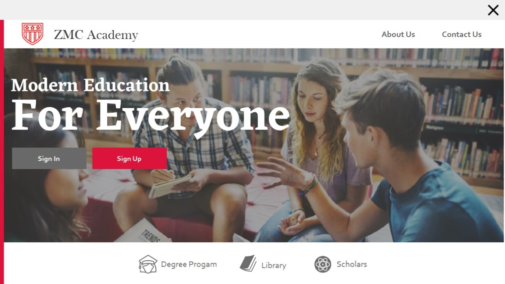
  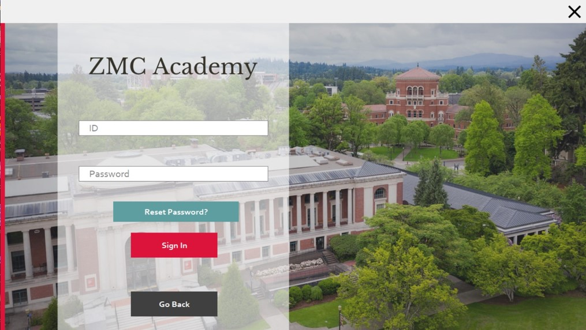
</p>
<p align="center">
  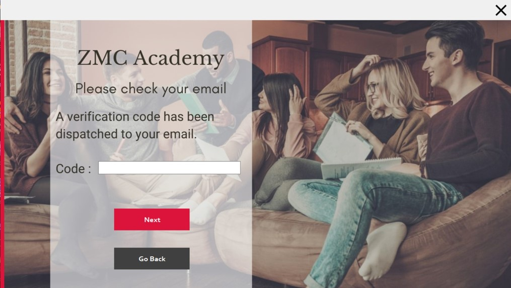
  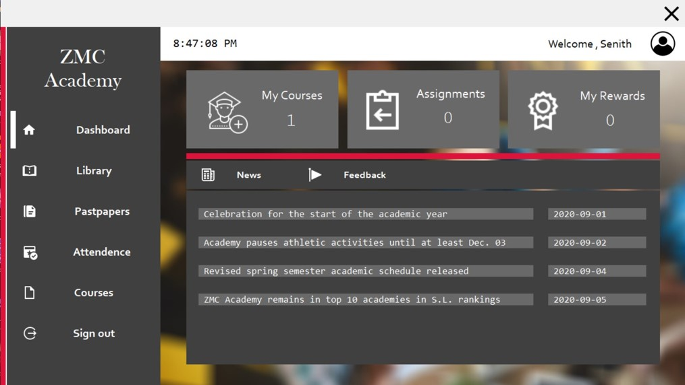
</p>
<p align="center">
  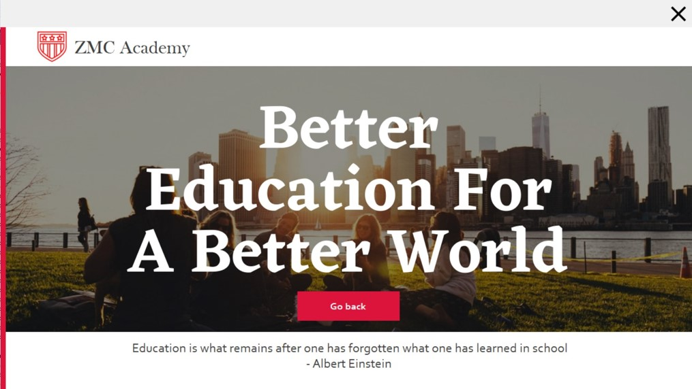
  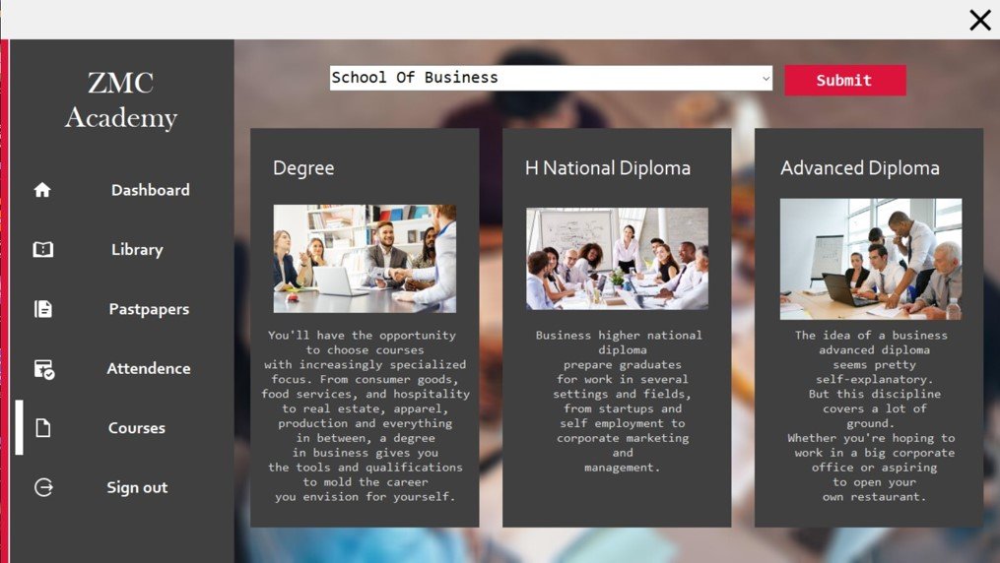
</p>

<details>
<summary>more screens</summary>

<p align="center">
  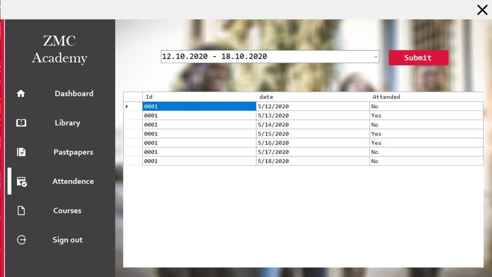
  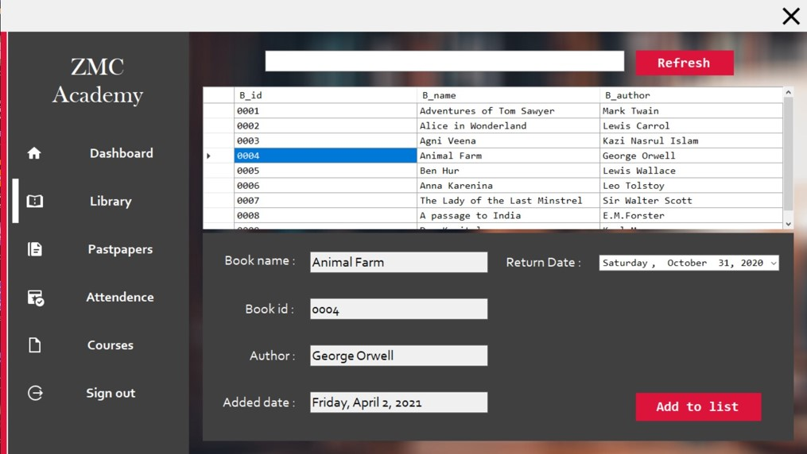
</p>
<p align="center">
  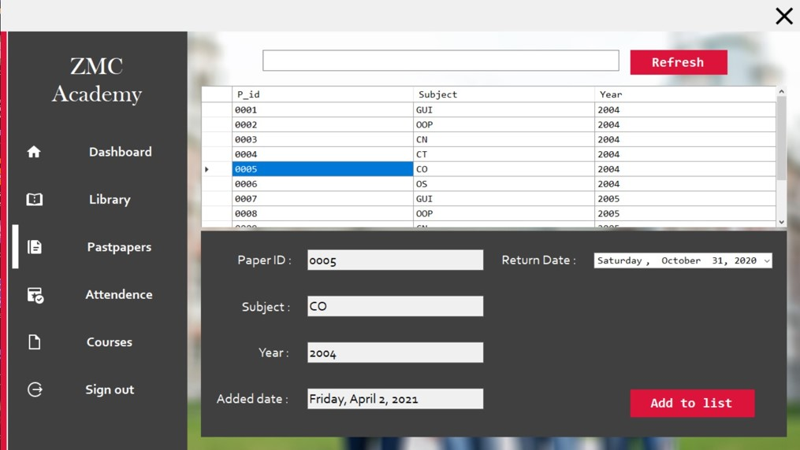
  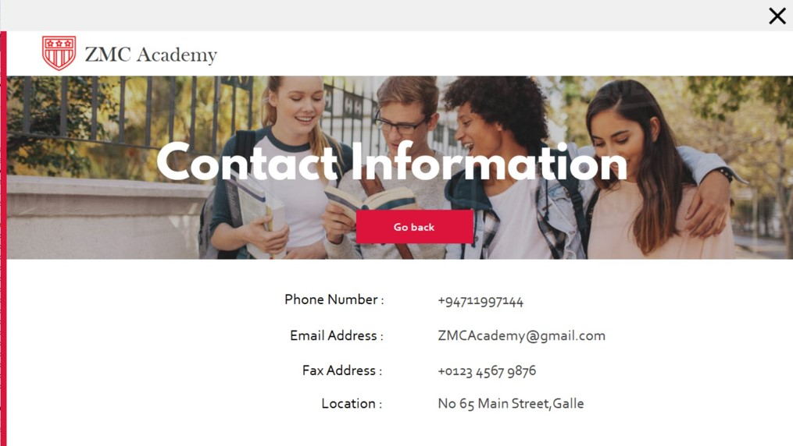
</p>
<p align="center">
  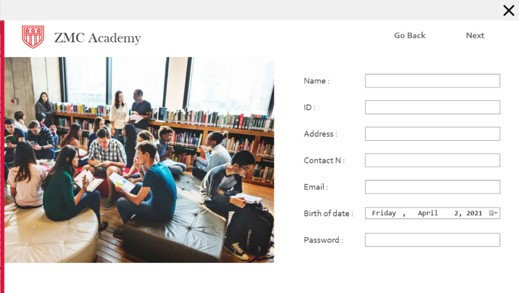
  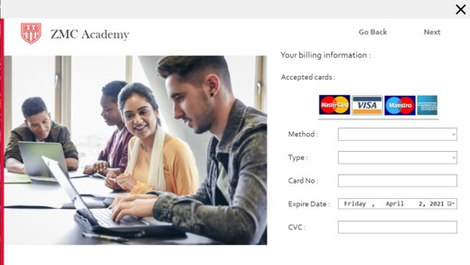
</p>

</details>

## what it does

The app models a small academy/student portal with two broad parts:

**onboarding**

- multi-step student registration
- personal details and contact information
- O/L result capture
- A/L result capture
- extra qualifications
- course selection
- a historical payment-form prototype
- email verification before the account is created
- sign in and password-reset flows

**student portal**

- academy news
- course information
- attendance history
- searchable library catalog
- book-list / return-date tracking
- past-paper browsing
- support/problem reports
- student dashboard and sign-out flow

The interesting part is not that every one of those screens is sophisticated. It is that they all ended up sharing the same local SQL Server model and WinForms navigation flow.

## the registration flow

The original project spreads onboarding across `Signup1` through `Signup9`.

```text
personal details
      ↓
O/L results
      ↓
A/L results
      ↓
qualification #1
      ↓
qualification #2
      ↓
course
      ↓
payment-form prototype
      ↓
review / confirmation
      ↓
email verification
      ↓
transactional database write
```

The final registration step now writes the related records inside one SQL transaction. If one insert fails, the partial student record is rolled back instead of leaving several half-created rows behind.

Passwords created by the current code are stored as salted **PBKDF2-SHA256** hashes. The sign-in flow also contains a small migration path for development databases created by the original plaintext-password implementation: after a successful legacy login, the password is replaced with a hash.

## the dashboard

After sign-in, the main WinForms dashboard switches between embedded user controls rather than opening a separate window for every section.

```text
Dash1
 ├── News1
 ├── library1
 ├── Pastpapers1
 ├── Attendence1
 ├── Courses1
 └── Calander1   ← support/problem report screen
```

Yes, some of the names are very 2021. I kept them because this is still the original project rather than a disguised rewrite.

## library side quest

The library is one of the more complete pieces of the app.

A student can browse the catalog, type a title prefix to filter books, select a book, choose a return date and add it to their book list. The current data-access code uses parameterized queries and scopes borrowed-book records to the signed-in student ID.

```text
Books
  │
  ├── search by title
  │
  └── select B_id
          ↓
     choose return date
          ↓
       Booklist
      /        \
   B_id         Id
   book       student
```

Past papers follow a similar small catalog/list pattern.

## attendance + support

Attendance is split into the two historical tables used by the coursework project. The UI chooses one of those known table names and loads only records for the authenticated student.

The screen named `Calander1` is actually the support/problem-report flow. A student can submit a summary and details, which are stored with the current student ID and timestamp.

## current security cleanup

I came back to this repo years later and fixed the parts that should not stay in public example code:

- SQL access now goes through a shared database helper
- local database configuration can come from `ZMC_DB_CONNECTION_STRING`
- queries touched during the cleanup use SQL parameters rather than interpolating user input
- new passwords use PBKDF2-SHA256 rather than plaintext storage
- legacy plaintext development passwords can migrate on successful login
- registration writes are wrapped in a SQL transaction
- the payment prototype persists only the final four card digits; it does **not** persist the CVC
- SMTP credentials are no longer embedded in source
- email configuration comes from `ZMC_SMTP_*` environment variables
- generated Visual Studio output and local `.mdf/.ldf` databases are no longer meant to live in Git

This still should not be treated as a production identity, payments or education platform. Those changes are repository hygiene, not a claim that the original architecture suddenly became enterprise software.

## stack

| Area | Technology |
| --- | --- |
| UI | C# Windows Forms |
| Runtime | .NET Framework 4.7.2 |
| Database | SQL Server / LocalDB |
| Data access | `System.Data.SqlClient` |
| Email | `System.Net.Mail` |
| Password storage | PBKDF2-SHA256 |
| Build | Visual Studio / MSBuild |

## project structure

```text
zmc-academy/
├── Database.sql
├── Directory.Build.targets
├── WF CW2 TEST.sln
├── WF CW2 TEST/
│   ├── Infrastructure/
│   │   └── Database.cs
│   ├── Security/
│   │   └── PasswordHasher.cs
│   ├── Services/
│   │   └── EmailService.cs
│   ├── Signup1.cs ... Signup9.cs
│   ├── Signin1.cs
│   ├── Resetpass1.cs / Resetpass2.cs
│   ├── Dash1.cs
│   ├── News1.cs
│   ├── library1.cs
│   ├── Pastpapers1.cs
│   ├── Attendence1.cs
│   ├── Courses1.cs
│   └── Calander1.cs
└── docs/
    └── engineering.md
```

The `.Designer.cs` and `.resx` files are intentionally still here: this is a WinForms project and they contain the actual generated layout/resource definitions used by Visual Studio.

## running it

This is a Windows/.NET Framework project.

1. Install Visual Studio with **.NET desktop development** and .NET Framework 4.7.2 targeting support.
2. Create the development database using `Database.sql`.
3. Point the app at SQL Server/LocalDB with `ZMC_DB_CONNECTION_STRING` when the default LocalDB database name is not suitable.
4. If you want to exercise email verification/password reset, configure the SMTP environment variables below.
5. Open `WF CW2 TEST.sln` and build/run the project.

Example database configuration:

```powershell
$env:ZMC_DB_CONNECTION_STRING = "Data Source=(LocalDB)\MSSQLLocalDB;Initial Catalog=ZMC_Academy;Integrated Security=True"
```

Email configuration:

```powershell
$env:ZMC_SMTP_USERNAME = "your-smtp-user"
$env:ZMC_SMTP_PASSWORD = "your-app-password"
$env:ZMC_SMTP_FROM = "academy@example.com"
$env:ZMC_SMTP_HOST = "smtp.gmail.com"   # optional
$env:ZMC_SMTP_PORT = "587"              # optional
```

No real credentials belong in source control.

## database model, roughly

```text
Registration
 ├── Ol_Results
 ├── Al_Results
 ├── Other_Qualifications
 ├── Other_Qualifications1
 ├── Course
 ├── Payment
 ├── Booklist ───── Books
 ├── Pastpaperlist ─ Pastpapers
 ├── Attendence1
 ├── Attendence2
 └── Report_problem

News
```

The schema is intentionally close to the original coursework model so the historical code remains understandable. `Database.sql` has been cleaned into a reproducible development schema instead of containing machine-specific database files or personal seed records.

## things I would build differently now

The biggest change would be separating UI state from persistence.

```text
WinForms / desktop UI
        │
        ▼
application services
        │
        ├── AuthenticationService
        ├── RegistrationService
        ├── LibraryService
        ├── AttendanceService
        └── SupportService
        │
        ▼
repositories / database
```

I would also replace the chain of nine form classes with one explicit registration state model, use migrations instead of a hand-maintained SQL script, model qualifications as rows in one table rather than duplicated tables, put email behind a real service boundary, and remove the payment-card UI entirely unless a hosted payment provider owned that flow.

The deeper breakdown is in [`docs/engineering.md`](docs/engineering.md).

## why keep this repo?

Because it is a useful time capsule.

It shows the point where I was learning how UI screens, validation, SQL, authentication, email, and larger multi-step workflows fit together — including several decisions I would absolutely not repeat now.

That progression is more interesting to me than rewriting the whole thing in a modern framework and pretending it was always that clean.

---

built as a student desktop project; kept around as one of the older side quests.
